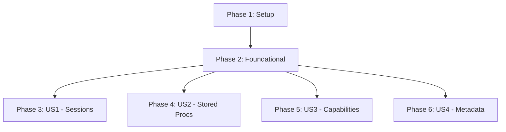

# Implementation Tasks: Python MCP Server Advanced Features

**Feature**: 001-python-mcp-server
**Branch**: `001-python-mcp-server`
**Date**: 2026-01-03
**Status**: Ready for Implementation

## Overview

This document provides a complete, dependency-ordered task breakdown for implementing advanced features in the Python MCP Server. Tasks are organized by user story to enable independent implementation and testing.

## Task Summary

- **Total Tasks**: 52
- **Setup Tasks**: 5
- **Foundational Tasks**: 7
- **User Story 1 (US1)**: 11 tasks - Session Management
- **User Story 2 (US2)**: 12 tasks - Stored Procedure Execution
- **User Story 3 (US3)**: 8 tasks - Server Capability Detection
- **User Story 4 (US4)**: 9 tasks - Advanced Table Metadata

## Implementation Strategy

**MVP Scope**: User Story 1 (Session Management)
- Provides immediate value for long-running queries
- Foundation for other features
- Can be deployed independently

**Incremental Delivery**:
1. **Phase 1**: US1 (Session Management) - Deploy to get user feedback
2. **Phase 2**: US2 (Stored Procedures) + US3 (Capabilities) - Can be developed in parallel
3. **Phase 3**: US4 (Metadata) - Independent, can be added last

---

## Phase 1: Setup & Configuration

**Goal**: Initialize project structure and dependencies for advanced features.

**Tasks**:

- [X] T001 Update python-mcp-server/requirements.txt to add pytest-asyncio for async testing
- [X] T002 Create python-mcp-server/tests/__init__.py directory structure
- [X] T003 Update python-mcp-server/mssqlclient_mcp/config.py to add ENABLE_START_QUERY, ENABLE_START_STORED_PROCEDURE, MAX_CONCURRENT_SESSIONS, SESSION_CLEANUP_INTERVAL_MINUTES config values
- [X] T004 Update python-mcp-server/.env.example to document new environment variables for session management and SP execution
- [X] T005 Create python-mcp-server/mssqlclient_mcp/type_mapper.py module for Python-to-SQL type conversion utilities

**Acceptance**: All config values accessible, test directory created, type mapper module ready for implementation.

---

## Phase 2: Foundational Components

**Goal**: Implement shared infrastructure needed by multiple user stories.

**Tasks**:

- [X] T006 [P] Add SessionStatus and SessionType enums to python-mcp-server/mssqlclient_mcp/models.py
- [X] T007 [P] Add QuerySession dataclass to python-mcp-server/mssqlclient_mcp/models.py with all required fields and methods
- [X] T008 [P] Add StoredProcedureParameter dataclass to python-mcp-server/mssqlclient_mcp/models.py
- [X] T009 [P] Add ServerCapability dataclass to python-mcp-server/mssqlclient_mcp/models.py
- [X] T010 [P] Add TableIndex, ForeignKey, TableStatistics dataclasses to python-mcp-server/mssqlclient_mcp/models.py
- [X] T011 Implement EnhancedJSONEncoder class in python-mcp-server/mssqlclient_mcp/models.py for serializing datetime and Enum types
- [X] T012 Implement type_mapping dictionary and convert_python_to_sql function in python-mcp-server/mssqlclient_mcp/type_mapper.py

**Acceptance**: All data models defined, JSON serialization working, type conversion utility ready.

**Parallel Opportunities**: Tasks T006-T010 can be implemented in parallel (different dataclasses).

---

## Phase 3: User Story 1 - Session Management

**User Story**: US1 - Data Analyst - Long Running Queries
**As a** data analyst
**I want to** start a complex query in the background
**So that** I can continue working while it executes

**Independent Test Criteria**:
- ✅ Can start a query using `start_query` tool and receive session_id
- ✅ Can check status of running query without blocking
- ✅ Can retrieve results from completed session
- ✅ Can cancel a long-running session
- ✅ Sessions automatically cleaned up after 15 minutes
- ✅ Concurrent session limit enforced (max 10)

**Tasks**:

- [X] T013 [US1] Create SessionManager class in python-mcp-server/mssqlclient_mcp/database_service.py with __init__, _sessions dict, and ThreadPoolExecutor setup
- [X] T014 [US1] Implement SessionManager.start_query method in python-mcp-server/mssqlclient_mcp/database_service.py to create session and launch background thread
- [X] T015 [US1] Implement SessionManager._execute_query_in_background method in python-mcp-server/mssqlclient_mcp/database_service.py to run query in thread pool
- [X] T016 [US1] Implement SessionManager.get_session method in python-mcp-server/mssqlclient_mcp/database_service.py to retrieve session by ID
- [X] T017 [US1] Implement SessionManager.list_sessions method in python-mcp-server/mssqlclient_mcp/database_service.py to get all active/completed sessions
- [X] T018 [US1] Implement SessionManager.cancel_session method in python-mcp-server/mssqlclient_mcp/database_service.py to stop running session
- [X] T019 [US1] Implement SessionManager.cleanup_completed_sessions method in python-mcp-server/mssqlclient_mcp/database_service.py with 15-minute TTL logic
- [X] T020 [US1] Register start_query MCP tool in python-mcp-server/mssqlclient_mcp/server.py with ENABLE_START_QUERY check
- [X] T021 [US1] Register get_session_status MCP tool in python-mcp-server/mssqlclient_mcp/server.py
- [X] T022 [US1] Register get_session_result MCP tool in python-mcp-server/mssqlclient_mcp/server.py
- [X] T023 [US1] Register cancel_session MCP tool in python-mcp-server/mssqlclient_mcp/server.py

**Acceptance for US1**:
- All 4 session tools (start_query, get_session_status, get_session_result, cancel_session) registered and working
- Can execute query in background and retrieve results
- Session cleanup runs automatically
- Concurrent session limit enforced

**Parallel Opportunities**:
- T013-T019 (SessionManager methods) can be implemented in sequence (dependencies on previous methods)
- T020-T023 (MCP tool registration) can be implemented in parallel once SessionManager is complete

**US1 Dependencies**: Requires Phase 1 (Setup) and Phase 2 (Foundational) complete.

---

## Phase 4: User Story 2 - Stored Procedure Execution

**User Story**: US2 - Developer - Stored Procedure Integration
**As a** developer
**I want to** execute stored procedures with parameters
**So that** I can leverage existing database logic

**Independent Test Criteria**:
- ✅ Can discover parameters for a stored procedure
- ✅ Can execute SP with typed parameters (int, string, datetime, decimal)
- ✅ Parameter type validation occurs before execution
- ✅ Clear error messages for type conversion failures
- ✅ Handles multiple result sets from procedures
- ✅ Works in both Database and Server modes

**Tasks**:

- [X] T024 [P] [US2] Implement get_stored_procedure_parameters_query SQL in python-mcp-server/mssqlclient_mcp/database_service.py using sys.parameters
- [X] T025 [US2] Implement DatabaseService.get_sp_parameters method in python-mcp-server/mssqlclient_mcp/database_service.py to query and return StoredProcedureParameter list
- [X] T026 [P] [US2] Implement validate_parameter function in python-mcp-server/mssqlclient_mcp/type_mapper.py to check type compatibility
- [X] T027 [P] [US2] Implement convert_parameters_for_execution function in python-mcp-server/mssqlclient_mcp/type_mapper.py to convert dict of params to SQL-compatible values
- [X] T028 [US2] Implement DatabaseService.execute_stored_procedure method in python-mcp-server/mssqlclient_mcp/database_service.py with parameter binding and multi-resultset support
- [X] T029 [US2] Implement SessionManager.start_stored_procedure method in python-mcp-server/mssqlclient_mcp/database_service.py for background SP execution
- [X] T030 [US2] Implement SessionManager._execute_sp_in_background method in python-mcp-server/mssqlclient_mcp/database_service.py
- [X] T031 [US2] Register get_stored_procedure_parameters MCP tool in python-mcp-server/mssqlclient_mcp/server.py
- [X] T032 [US2] Register execute_stored_procedure MCP tool in python-mcp-server/mssqlclient_mcp/server.py with ENABLE_EXECUTE_STORED_PROCEDURE check
- [X] T033 [US2] Register start_stored_procedure MCP tool in python-mcp-server/mssqlclient_mcp/server.py with ENABLE_START_STORED_PROCEDURE check
- [ ] T034 [US2] Add format_sp_parameters_table formatter in python-mcp-server/mssqlclient_mcp/formatters.py for parameter discovery output
- [ ] T035 [US2] Update python-mcp-server/README.md to document stored procedure execution with parameter examples

**Acceptance for US2**:
- Can discover all parameters with correct types and defaults
- Can execute SPs with parameters synchronously and asynchronously
- Type validation prevents invalid parameter types
- Multiple result sets handled correctly

**Parallel Opportunities**:
- T024-T025 (parameter discovery) independent from T026-T027 (type conversion)
- T031-T033 (MCP tools) can be implemented in parallel once core methods done

**US2 Dependencies**: Requires Phase 1, Phase 2. Can be developed in parallel with US3 and US4 after Phase 2.

---

## Phase 5: User Story 3 - Server Capability Detection

**User Story**: US3 - Database Administrator - Server Assessment
**As a** database administrator
**I want to** understand SQL Server capabilities
**So that** I can recommend appropriate features

**Independent Test Criteria**:
- ✅ Reports correct SQL Server version and edition
- ✅ Detects deployment type (Azure SQL DB, Azure VM, On-Premises)
- ✅ Reports 10+ SQL Server features accurately
- ✅ Capability results cached for 1 hour
- ✅ Cache keyed per connection string
- ✅ Executes in <500ms (with cache)

**Tasks**:

- [X] T036 [P] [US3] Implement CapabilityDetector class in python-mcp-server/mssqlclient_mcp/database_service.py with cache dictionary and TTL logic
- [X] T037 [US3] Implement CapabilityDetector._query_version_info SQL query in python-mcp-server/mssqlclient_mcp/database_service.py using @@VERSION and SERVERPROPERTY
- [X] T038 [US3] Implement CapabilityDetector._detect_deployment_type method in python-mcp-server/mssqlclient_mcp/database_service.py to identify Azure vs On-Prem
- [X] T039 [US3] Implement CapabilityDetector._determine_feature_support method in python-mcp-server/mssqlclient_mcp/database_service.py with version-based feature flags
- [X] T040 [US3] Implement CapabilityDetector.get_capabilities method in python-mcp-server/mssqlclient_mcp/database_service.py with cache check and detection
- [X] T041 [US3] Register get_server_capabilities MCP tool in python-mcp-server/mssqlclient_mcp/server.py
- [ ] T042 [US3] Add format_capabilities_report formatter in python-mcp-server/mssqlclient_mcp/formatters.py for capability output
- [ ] T043 [US3] Update python-mcp-server/README.md to document capability detection and feature list

**Acceptance for US3**:
- Capability detection returns accurate version and feature flags
- Caching works correctly (no repeated queries within 1 hour)
- Works with SQL Server 2016, 2017, 2019, 2022
- Azure SQL Database correctly identified

**Parallel Opportunities**:
- T036-T040 (capability detection) must be sequential
- T041-T042 (tool + formatter) can be parallel after T040 complete

**US3 Dependencies**: Requires Phase 1, Phase 2. Can be developed in parallel with US2 and US4 after Phase 2.

---

## Phase 6: User Story 4 - Advanced Table Metadata

**User Story**: US4 - Data Engineer - Schema Analysis
**As a** data engineer
**I want to** see complete table metadata
**So that** I can understand data relationships and structure

**Independent Test Criteria**:
- ✅ Lists all indexes with type, columns, and properties
- ✅ Shows foreign key relationships with ON DELETE/UPDATE actions
- ✅ Reports table size (rows, data KB, index KB)
- ✅ Identifies primary keys and unique constraints
- ✅ Displays included columns for non-clustered indexes
- ✅ All queries complete in <5 seconds

**Tasks**:

- [X] T044 [P] [US4] Implement get_table_indexes_query SQL in python-mcp-server/mssqlclient_mcp/database_service.py using sys.indexes and sys.index_columns
- [X] T045 [P] [US4] Implement get_foreign_keys_query SQL in python-mcp-server/mssqlclient_mcp/database_service.py using sys.foreign_keys
- [X] T046 [P] [US4] Implement get_table_statistics_query SQL in python-mcp-server/mssqlclient_mcp/database_service.py using sys.partitions and sys.allocation_units
- [X] T047 [US4] Implement DatabaseService.get_table_indexes method in python-mcp-server/mssqlclient_mcp/database_service.py returning list of TableIndex
- [X] T048 [US4] Implement DatabaseService.get_table_foreign_keys method in python-mcp-server/mssqlclient_mcp/database_service.py returning list of ForeignKey
- [X] T049 [US4] Implement DatabaseService.get_table_statistics method in python-mcp-server/mssqlclient_mcp/database_service.py returning TableStatistics
- [X] T050 [US4] Register get_table_indexes MCP tool in python-mcp-server/mssqlclient_mcp/server.py
- [X] T051 [US4] Register get_table_foreign_keys MCP tool in python-mcp-server/mssqlclient_mcp/server.py
- [X] T052 [US4] Register get_table_statistics MCP tool in python-mcp-server/mssqlclient_mcp/server.py

**Acceptance for US4**:
- Index information matches SQL Server Management Studio
- Foreign key relationships correctly mapped
- Table sizes accurately calculated
- All metadata queries performant (<5s)

**Parallel Opportunities**:
- T044-T046 (SQL queries) can be written in parallel (independent)
- T047-T049 (service methods) can be implemented in parallel
- T050-T052 (MCP tools) can be registered in parallel

**US4 Dependencies**: Requires Phase 1, Phase 2. Can be developed in parallel with US2 and US3 after Phase 2.

---

## Dependencies and Execution Order

### Story-Level Dependencies

**Critical Path**: Setup → Foundational → US1
**Parallel Work**: After Phase 2, US2, US3, and US4 can be developed concurrently

### Task-Level Dependencies

**Phase 1 → Phase 2**: All Phase 1 tasks must complete before Phase 2
**Phase 2 → User Stories**: All Phase 2 tasks must complete before any user story
**Within User Stories**: Sequential within story (except where marked [P])

## Parallel Execution Examples

### Maximum Parallelism (4 developers)

**Week 1**: Complete Phase 1 + Phase 2 together
**Week 2+**:
- Developer 1: US1 (Session Management) - Priority 1
- Developer 2: US2 (Stored Procedures)
- Developer 3: US3 (Capabilities)
- Developer 4: US4 (Metadata)

### MVP Focus (1-2 developers)

**Week 1**: Phase 1 + Phase 2
**Week 2-3**: US1 (Session Management) - **Deploy MVP**
**Week 4**: US2 (Stored Procedures)
**Week 5**: US3 (Capabilities) + US4 (Metadata) in parallel

## Testing Strategy

**Note**: Comprehensive test suite is out of scope (per spec.md). Minimal testing approach:

1. **Manual Testing**: Use quickstart.md examples to verify each user story
2. **Integration Testing**: Test with real SQL Server instance (not mocked)
3. **Acceptance Testing**: Verify each user story's acceptance criteria

**If tests are requested later**, add these tasks:
- Create test_session_manager.py for US1
- Create test_stored_procedures.py for US2
- Create test_capabilities.py for US3
- Create test_metadata.py for US4

## File Change Summary

### Modified Files
- `python-mcp-server/requirements.txt` - Add pytest-asyncio
- `python-mcp-server/.env.example` - Add session/SP config variables
- `python-mcp-server/mssqlclient_mcp/config.py` - Add new config values
- `python-mcp-server/mssqlclient_mcp/models.py` - Add 6 new dataclasses
- `python-mcp-server/mssqlclient_mcp/database_service.py` - Add SessionManager, CapabilityDetector, new DB methods (~600 lines)
- `python-mcp-server/mssqlclient_mcp/server.py` - Register 10 new MCP tools (~200 lines)
- `python-mcp-server/mssqlclient_mcp/formatters.py` - Add 2 new formatters (~100 lines)
- `python-mcp-server/README.md` - Document new features

### New Files
- `python-mcp-server/tests/__init__.py` - Test directory
- `python-mcp-server/mssqlclient_mcp/type_mapper.py` - Type conversion utilities (~300 lines)

**Total New Lines**: ~1,500 (matches plan.md estimate)

## Validation Checklist

Before marking feature complete, verify:

- [ ] All 52 tasks completed
- [ ] All 4 user stories pass acceptance criteria
- [ ] All 10 new MCP tools registered and documented
- [ ] README.md updated with examples
- [ ] Manual testing completed per quickstart.md
- [ ] Backward compatibility verified (existing tools still work)
- [ ] Security flags enforced (ENABLE_START_QUERY, etc.)
- [ ] Performance goals met (sessions <100ms, capabilities <500ms, metadata <5s)

## Next Steps

1. Review this task breakdown
2. Choose implementation strategy (MVP vs Full)
3. Begin with Phase 1 (Setup)
4. After Phase 2, select user story priority order
5. Implement user stories incrementally
6. Test each story independently before moving to next

**Estimated Effort**:
- Phase 1 + 2: 1-2 days
- US1: 2-3 days
- US2: 2-3 days
- US3: 1-2 days
- US4: 1-2 days

**Total**: ~10-14 days for one developer, ~5-7 days with parallelization

---

**Document Version**: 1.0
**Last Updated**: 2026-01-03
**Generated by**: /speckit.tasks command
